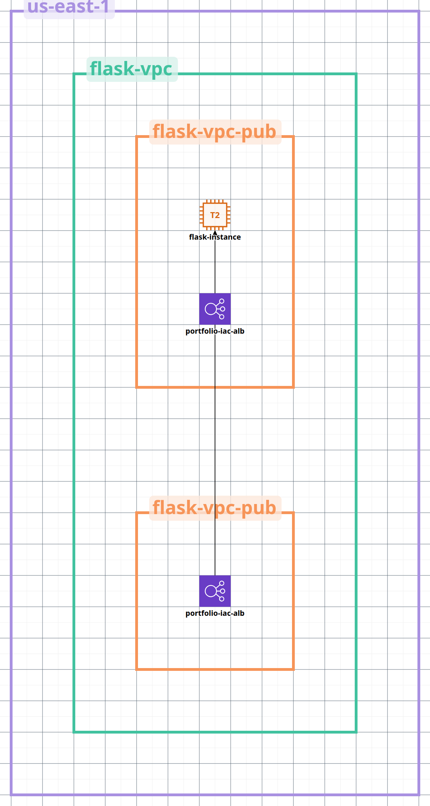

# DevOps Portfolio

Bem-vindo(a) ao meu portfólio de projetos de Infraestrutura e Automação! Este repositório demonstra minhas habilidades em diversas áreas do DevOps, através de quatro projetos distintos:

- **Projeto 1 – IaC**: Provisionamento completo de um ambiente Flask "Hello, Terraform!" utilizando Terraform na AWS.
- **Projeto 2 – CI/CD**: Implementação de um pipeline de Integração Contínua e Entrega Contínua utilizando GitHub Actions e/ou Jenkins para uma aplicação Dockerizada.
- **Projeto 3 – Kubernetes**: Orquestração de uma aplicação em um cluster Kubernetes (EKS, AKS ou Minikube) com soluções de monitoramento integradas.
- **Projeto 4 – DevSecOps**: Incorporação de práticas de segurança no pipeline de desenvolvimento, incluindo análise de segurança estática (SAST), análise de segurança dinâmica (DAST) e gestão segura de segredos.

---

# Projeto 1 – IaC: Provisionamento Completo de um Ambiente Flask "Hello, Terraform!" na AWS

## Visão Geral

Este projeto demonstra a criação e o provisionamento completo de um ambiente para executar uma simples aplicação Flask "Hello, Terraform!" na AWS utilizando a ferramenta de Infraestrutura como Código (IaC) Terraform. O objetivo é automatizar a configuração da infraestrutura necessária, incluindo uma Virtual Private Cloud (VPC), subnets públicas, um Internet Gateway, uma instância EC2 e um Application Load Balancer (ALB) para tornar a aplicação acessível.

## Arquitetura

A arquitetura do projeto é a seguinte:



## Pré-requisitos

Antes de começar, você precisará ter o seguinte instalado e configurado:

* **AWS CLI:** A Interface de Linha de Comando da AWS ([https://aws.amazon.com/cli/](https://aws.amazon.com/cli/)) configurada com suas credenciais da AWS. Certifique-se de ter as permissões necessárias para criar os recursos descritos.
* **Terraform:** A ferramenta de IaC Terraform ([https://www.terraform.io/downloads](https://www.terraform.io/downloads)) instalada no seu sistema.
* **Python e Pip:** Necessários para executar a aplicação Flask na instância EC2.
* **Chave SSH:** Um par de chaves SSH da AWS configurado na região `us-east-1`. Você precisará do nome da chave para configurar a instância EC2.
* **Backend Remoto Terraform:** Um bucket S3 e uma tabela DynamoDB configurados na sua conta AWS para armazenar o estado do Terraform remotamente.

## Como Executar o Projeto

Siga estes passos para provisionar e executar o ambiente Flask:

1.  **Clonar o Repositório (se aplicável):**
    ```bash
    git clone seu_repositorio.git
    cd projeto1-iac
    ```

2.  **Configurar o Backend Remoto do Terraform:**
    Crie um arquivo `terraform.tf` (se ainda não existir) na raiz do seu projeto com a seguinte configuração, substituindo os placeholders com seus valores reais:

    ```terraform
    terraform {
      backend "s3" {
        bucket = "nome do bucket"
        key    = "projeto1/terraform.tfstate"
        region = "us-east-1"
        dynamodb_table = "o nome da tabela que você criou"
      }
    }
    ```

3.  **Inicializar o Terraform:**
    Navegue até o diretório raiz do seu projeto Terraform no terminal e execute:
    ```bash
    terraform init
    ```
    Este comando inicializa o diretório de trabalho do Terraform, baixa os providers necessários (AWS) e configura o backend remoto.

4.  **Definir as Variáveis:**
    Você precisará fornecer valores para as variáveis definidas nos seus arquivos `.tfvars` ou interativamente. Crie um arquivo `terraform.tfvars` na raiz do seu projeto (recomendado) e preencha com os valores apropriados:

    ```terraform
    vpc_cidr            = "10.0.0.0/16"
    public_subnet_cidr_az1 = "10.0.1.0/24"
    public_subnet_cidr_az2 = "10.0.2.0/24"
    availability_zone   = "us-east-1a" # Usado para a instância EC2
    region              = "us-east-1"
    vpc_name            = "flask-app-vpc"
    ami_id              = "ami-XXXXXXXXXXXXXXX" # Substitua pela AMI ID desejada na região us-east-1, neste projeto usamos o ubuntu
    instance_type       = "t2.micro"
    key_name            = "sua-chave-ssh" # Substitua pelo nome da sua chave SSH
    instance_name       = "flask-app-instance"
    project_name        = "flask-app-project"
    ```
    
5.  **Verificar o Plano de Execução:**
    Execute o seguinte comando para ver as mudanças que o Terraform irá realizar na sua infraestrutura da AWS:
    ```bash
    terraform plan
    ```
    Revise cuidadosamente o plano para garantir que os recursos a serem criados correspondam às suas expectativas.

6.  **Aplicar a Configuração do Terraform:**
    Se o plano for satisfatório, execute o seguinte comando para provisionar a infraestrutura na AWS:
    ```bash
    terraform apply -auto-approve
    ```
    O `-auto-approve` aprova automaticamente a aplicação do plano. Em ambientes de produção, é recomendável remover essa flag para revisar o plano antes da aplicação.

7.  **Acessar a Aplicação Flask:**
    Após a conclusão bem-sucedida do `terraform apply`, o Terraform exibirá os outputs definidos no seu módulo de Load Balancer, incluindo o `lb_dns_name`. Copie esse nome DNS e cole-o no seu navegador web. Você deverá ver a mensagem do nosso código configurado no app.py.

8.  **Acessar a Instância EC2 via SSH (opcional):**
    Você pode acessar a instância EC2 usando SSH com a chave que você especificou:
    ```bash
    ssh -i "chave.pem" ec2-user@<ip_publico_da_instancia>
    ```
    Você pode encontrar o IP público da instância no console da AWS ou nos outputs do Terraform (se você configurou os outputs corretamente).

## Limpeza da Infraestrutura

Para evitar custos contínuos na AWS, é importante destruir os recursos provisionados quando não forem mais necessários. Execute o seguinte comando no diretório raiz do seu projeto Terraform:

## Boas Práticas Adotadas

**Infraestrutura como Código (IaC)**: Utilização do Terraform para definir e provisionar a infraestrutura de forma automatizada e versionada.

**Modularidade**: Organização do código Terraform em módulos lógicos (network, compute, loadbalancer) para melhor gerenciamento e reutilização.

**Backend Remoto**: Configuração de um backend remoto (S3 e DynamoDB) para armazenar o estado do Terraform de forma segura e permitir colaboração.

**Variáveis**: Utilização de variáveis para tornar a configuração mais flexível e personalizável.

**Outputs**: Exposição de informações importantes sobre a infraestrutura provisionada (como o DNS do Load Balancer).

**Segurança Básica**: Implementação de Security Groups para controlar o acesso à instância EC2 (limitando o tráfego de entrada para as portas necessárias).
